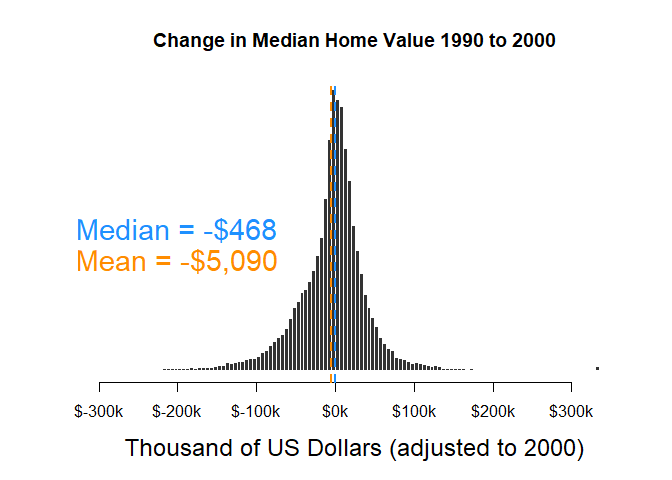
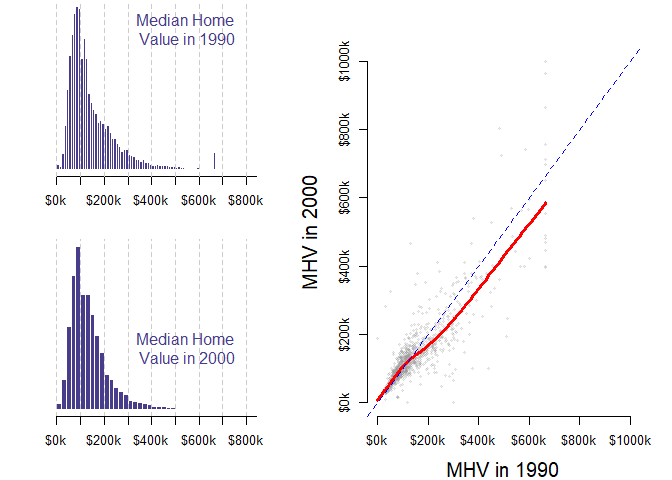
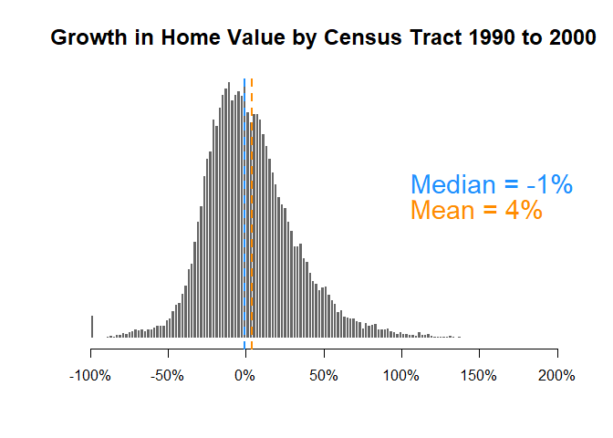
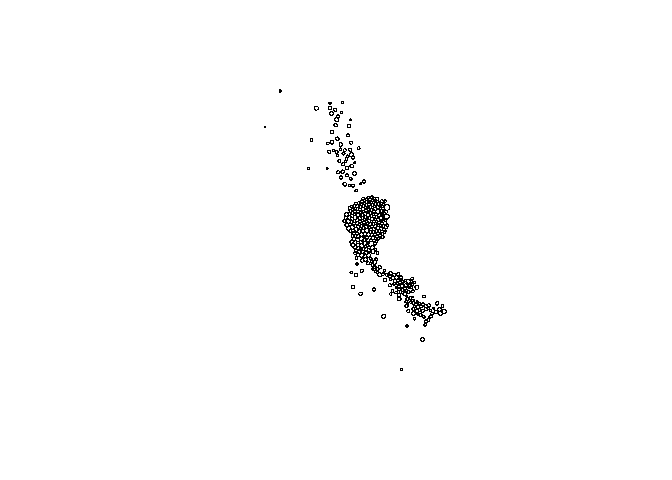
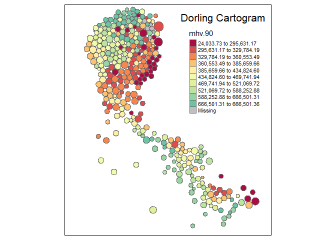
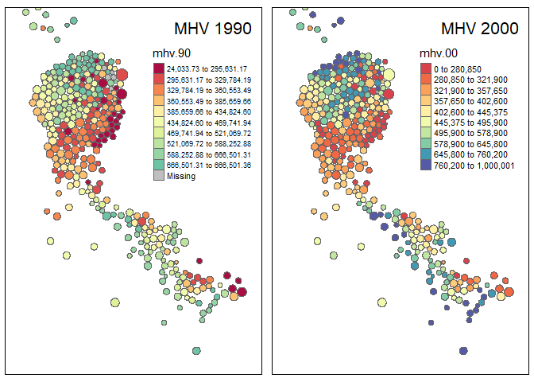
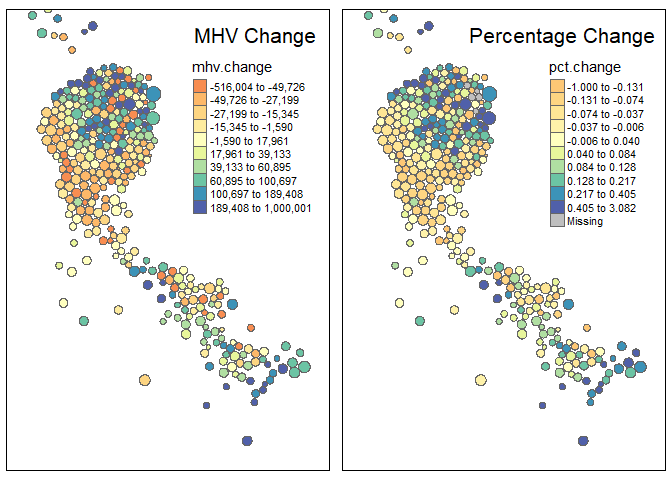
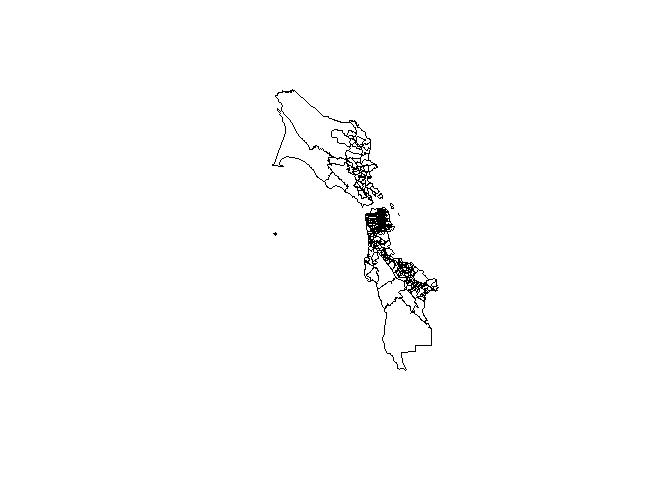
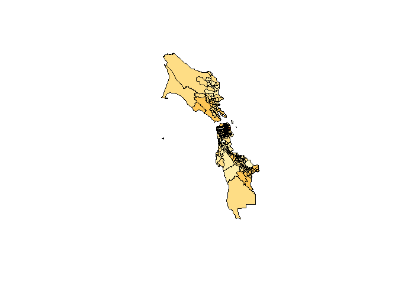

  
``` r
# load packages
library( cartogram )  # spatial maps w/ tract size bias reduction
library( colorspace )
library( dplyr )
library( geojsonio )   # read shapefiles
library( ggplot2 )     # graphing 
library( ggthemes )    # nice formats for ggplots
library( gridExtra )
library( here )
library( import )
library( knitr )
library( maptools )   # spatial object manipulation 
library( mclust )      # cluster analysis 
library( pander )      # formatting RMD tables
library( RColorBrewer )
library( scales )
library( sf )
library( sp )
library( stargazer)
library( tidycensus )
library( tidyverse )
library( tmap )        # theme maps
library( tmaptools )   # spatial object manipulation 
library( zoom )


# set stargazer type
s.type <- "html"
```

The following steps were used to load the data used in this page:

``` r
# load function source files
# note: all of these are R objects that will be used throughout this .rmd file

import::here("build_year",
             "RELEVANT_FILES",
             "obtain_crosswalk",
             "create_final_metadata_file",
             "compare_dfs",
             "jplot",
             "sf.pop",
             # notice the use of here::here() that points to the .R file
           # where all these R objects are created
             .from = here::here("analysis/utilities_master.R"),
             .character_only = TRUE)
```

Load data

``` r
d1 <- readRDS( here::here( "data/rodeo/LTDB-1990.rds" ) )
d2 <- readRDS( here::here( "data/rodeo/LTDB-2000.rds" ) )
md <- readRDS( here::here( "data/rodeo/LTDB-META-DATA.rds" ) )

# check to make sure we are not losing 
# or gaining observations in the merge
nrow( d1 ) 
```

    ## [1] 72693

merge d1 and d2

``` r
d1 <- select( d1, - year )
d2 <- select( d2, - year )

d <- merge( d1, d2, by="tractid" )
d <- merge( d, md, by="tractid" )

nrow( d )
```

    ## [1] 72693

Filter rural districts

``` r
table( d$urban )
```

    ## 
    ## rural urban 
    ## 12971 59722

``` r
d <- filter( d, urban == "urban" )
```

### Identify Common Variables

I have created a function to compare variables from two datasets:

``` r
vars <- compare_dfs( df1=d1, df2=d2 )
```

    ## [1] "SHARED VARIABLES:"
    ##   [1] "a15asn"  "a15blk"  "a15hsp"  "a15ntv"  "a15wht"  "a18und"  "a60asn"  "a60blk"  "a60hsp"  "a60ntv"  "a60up"   "a60wht"  "a75up"   "ag15up"  "ag25up"  "ag5up"  
    ##  [17] "ageasn"  "ageblk"  "agehsp"  "agentv"  "agewht"  "asian"   "china"   "clf"     "cni16u"  "col"     "cuban"   "dapov"   "dbpov"   "dflabf"  "dfmpov"  "dhpov"  
    ##  [33] "dis"     "dmulti"  "dnapov"  "dpov"    "dwpov"   "empclf"  "family"  "fb"      "fhh"     "filip"   "flabf"   "geanc"   "gefb"    "h10yrs"  "h30old"  "haw"    
    ##  [49] "hh"      "hha"     "hhb"     "hhh"     "hhw"     "hinc"    "hinca"   "hincb"   "hinch"   "hincw"   "hisp"    "hs"      "hu"      "incpc"   "india"   "iranc"  
    ##  [65] "irfb"    "itanc"   "itfb"    "japan"   "korea"   "lep"     "manuf"   "mar"     "mex"     "mhmval"  "mrent"   "multi"   "n10imm"  "n65pov"  "napov"   "nat"    
    ##  [81] "nbpov"   "nfmpov"  "nhblk"   "nhpov"   "nhwht"   "nnapov"  "npov"    "ntv"     "nwpov"   "ohu"     "olang"   "own"     "pop"     "pr"      "prof"    "rent"   
    ##  [97] "ruanc"   "rufb"    "scanc"   "scfb"    "semp"    "tractid" "unemp"   "vac"     "vet"     "viet"    "wds"    
    ## [1] "NOT SHARED:"
    ## [1] "ag16cv"  "ag18cv"  "hu00sp"  "hu90sp"  "ohu00sp" "ohu90sp" "pop90.1"

### Create Dataset for Analysis

Create subset for the analysis

``` r
d.full <- d  # keep a copy so don't have to reload 
d <- d.full  # store original in case you need to reset anything

d <- select( d, tractid, mhmval90, mhmval00, hinc90, 
             hu90, own90, rent90,  
             empclf90, clf90, unemp90, prof90,  
             dpov90, npov90,
             ag25up90, hs90, col90, 
             pop90.x, nhwht90, nhblk90, hisp90, asian90,
             cbsa, cbsaname )
d <- 
  d %>%
  mutate( p.white = 100 * nhwht90 / pop90.x,
          p.black = 100 * nhblk90 / pop90.x,
          p.hisp = 100 * hisp90 / pop90.x, 
          p.asian = 100 * asian90 / pop90.x,
          p.hs = 100 * (hs90+col90) / ag25up90,
          p.col = 100 * col90 / ag25up90,
          p.prof = 100 * prof90 / empclf90,
          p.unemp = 100 * unemp90 / clf90,
          pov.rate = 100 * npov90 / dpov90 )
```

View summary statistics for wrangled data

<table style="text-align:center">

<tr>

<td colspan="7" style="border-bottom: 1px solid black">

</td>

</tr>

<tr>

<td style="text-align:left">

Statistic

</td>

<td>

Min

</td>

<td>

Pctl(25)

</td>

<td>

Median

</td>

<td>

Mean

</td>

<td>

Pctl(75)

</td>

<td>

Max

</td>

</tr>

<tr>

<td colspan="7" style="border-bottom: 1px solid black">

</td>

</tr>

<tr>

<td style="text-align:left">

mhmval90

</td>

<td>

0

</td>

<td>

58,800

</td>

<td>

86,500

</td>

<td>

112,399

</td>

<td>

141,800

</td>

<td>

500,001

</td>

</tr>

<tr>

<td style="text-align:left">

mhmval00

</td>

<td>

0

</td>

<td>

81,600

</td>

<td>

119,900

</td>

<td>

144,738

</td>

<td>

173,894

</td>

<td>

1,000,001

</td>

</tr>

<tr>

<td style="text-align:left">

hinc90

</td>

<td>

4,999

</td>

<td>

24,355

</td>

<td>

32,033

</td>

<td>

34,160

</td>

<td>

41,520

</td>

<td>

150,001

</td>

</tr>

<tr>

<td style="text-align:left">

hu90

</td>

<td>

0

</td>

<td>

916

</td>

<td>

1,337

</td>

<td>

1,382

</td>

<td>

1,804

</td>

<td>

11,003

</td>

</tr>

<tr>

<td style="text-align:left">

own90

</td>

<td>

0

</td>

<td>

422

</td>

<td>

744

</td>

<td>

788

</td>

<td>

1,093

</td>

<td>

8,180

</td>

</tr>

<tr>

<td style="text-align:left">

rent90

</td>

<td>

0

</td>

<td>

168

</td>

<td>

358

</td>

<td>

476

</td>

<td>

663

</td>

<td>

8,653

</td>

</tr>

<tr>

<td style="text-align:left">

empclf90

</td>

<td>

0

</td>

<td>

1,015

</td>

<td>

1,555

</td>

<td>

1,625

</td>

<td>

2,157

</td>

<td>

11,816

</td>

</tr>

<tr>

<td style="text-align:left">

clf90

</td>

<td>

0

</td>

<td>

1,101

</td>

<td>

1,664

</td>

<td>

1,732

</td>

<td>

2,291

</td>

<td>

12,497

</td>

</tr>

<tr>

<td style="text-align:left">

unemp90

</td>

<td>

0

</td>

<td>

49

</td>

<td>

88

</td>

<td>

107

</td>

<td>

143

</td>

<td>

1,165

</td>

</tr>

<tr>

<td style="text-align:left">

prof90

</td>

<td>

0

</td>

<td>

192

</td>

<td>

359

</td>

<td>

451

</td>

<td>

616

</td>

<td>

6,290

</td>

</tr>

<tr>

<td style="text-align:left">

dpov90

</td>

<td>

0

</td>

<td>

2,219

</td>

<td>

3,250

</td>

<td>

3,332

</td>

<td>

4,365

</td>

<td>

23,619

</td>

</tr>

<tr>

<td style="text-align:left">

npov90

</td>

<td>

0

</td>

<td>

112

</td>

<td>

248

</td>

<td>

406

</td>

<td>

526

</td>

<td>

5,890

</td>

</tr>

<tr>

<td style="text-align:left">

ag25up90

</td>

<td>

0

</td>

<td>

1,444

</td>

<td>

2,121

</td>

<td>

2,187

</td>

<td>

2,865

</td>

<td>

18,461

</td>

</tr>

<tr>

<td style="text-align:left">

hs90

</td>

<td>

0

</td>

<td>

626

</td>

<td>

1,064

</td>

<td>

1,141

</td>

<td>

1,559

</td>

<td>

12,383

</td>

</tr>

<tr>

<td style="text-align:left">

col90

</td>

<td>

0

</td>

<td>

162

</td>

<td>

335

</td>

<td>

483

</td>

<td>

652

</td>

<td>

8,575

</td>

</tr>

<tr>

<td style="text-align:left">

pop90.x

</td>

<td>

0

</td>

<td>

2,283

</td>

<td>

3,325

</td>

<td>

3,419

</td>

<td>

4,464

</td>

<td>

35,721

</td>

</tr>

<tr>

<td style="text-align:left">

nhwht90

</td>

<td>

0

</td>

<td>

1,262

</td>

<td>

2,424

</td>

<td>

2,513

</td>

<td>

3,575

</td>

<td>

21,561

</td>

</tr>

<tr>

<td style="text-align:left">

nhblk90

</td>

<td>

0

</td>

<td>

18

</td>

<td>

76

</td>

<td>

426

</td>

<td>

331

</td>

<td>

12,121

</td>

</tr>

<tr>

<td style="text-align:left">

hisp90

</td>

<td>

0

</td>

<td>

27

</td>

<td>

75

</td>

<td>

347

</td>

<td>

280

</td>

<td>

13,873

</td>

</tr>

<tr>

<td style="text-align:left">

asian90

</td>

<td>

0

</td>

<td>

9

</td>

<td>

31

</td>

<td>

111

</td>

<td>

94

</td>

<td>

7,899

</td>

</tr>

<tr>

<td style="text-align:left">

p.white

</td>

<td>

0

</td>

<td>

64

</td>

<td>

87

</td>

<td>

74

</td>

<td>

95

</td>

<td>

100

</td>

</tr>

<tr>

<td style="text-align:left">

p.black

</td>

<td>

0

</td>

<td>

1

</td>

<td>

3

</td>

<td>

12

</td>

<td>

10

</td>

<td>

100

</td>

</tr>

<tr>

<td style="text-align:left">

p.hisp

</td>

<td>

0

</td>

<td>

1

</td>

<td>

3

</td>

<td>

10

</td>

<td>

9

</td>

<td>

100

</td>

</tr>

<tr>

<td style="text-align:left">

p.asian

</td>

<td>

0

</td>

<td>

0

</td>

<td>

1

</td>

<td>

3

</td>

<td>

3

</td>

<td>

94

</td>

</tr>

<tr>

<td style="text-align:left">

p.hs

</td>

<td>

0

</td>

<td>

69

</td>

<td>

74

</td>

<td>

74

</td>

<td>

80

</td>

<td>

100

</td>

</tr>

<tr>

<td style="text-align:left">

p.col

</td>

<td>

0

</td>

<td>

10

</td>

<td>

18

</td>

<td>

22

</td>

<td>

30

</td>

<td>

100

</td>

</tr>

<tr>

<td style="text-align:left">

p.prof

</td>

<td>

0

</td>

<td>

17

</td>

<td>

25

</td>

<td>

27

</td>

<td>

34

</td>

<td>

100

</td>

</tr>

<tr>

<td style="text-align:left">

p.unemp

</td>

<td>

0

</td>

<td>

4

</td>

<td>

5

</td>

<td>

7

</td>

<td>

8

</td>

<td>

64

</td>

</tr>

<tr>

<td style="text-align:left">

pov.rate

</td>

<td>

0

</td>

<td>

4

</td>

<td>

8

</td>

<td>

12

</td>

<td>

16

</td>

<td>

100

</td>

</tr>

<tr>

<td colspan="7" style="border-bottom: 1px solid black">

</td>

</tr>

</table>

# Part 01 - Change in Home Values

Initial conditions in 1990:

*(Note: inflation calculation based on calculator at westegg.com)*

<table style="text-align:center">

<tr>

<td colspan="7" style="border-bottom: 1px solid black">

</td>

</tr>

<tr>

<td style="text-align:left">

Statistic

</td>

<td>

Min

</td>

<td>

Pctl(25)

</td>

<td>

Median

</td>

<td>

Mean

</td>

<td>

Pctl(75)

</td>

<td>

Max

</td>

</tr>

<tr>

<td colspan="7" style="border-bottom: 1px solid black">

</td>

</tr>

<tr>

<td style="text-align:left">

MedianHomeValue1990

</td>

<td>

0

</td>

<td>

78,380

</td>

<td>

115,304

</td>

<td>

149,828

</td>

<td>

189,019

</td>

<td>

666,501

</td>

</tr>

<tr>

<td style="text-align:left">

MedianHomeValue2000

</td>

<td>

0

</td>

<td>

81,600

</td>

<td>

119,900

</td>

<td>

144,738

</td>

<td>

173,894

</td>

<td>

1,000,001

</td>

</tr>

<tr>

<td style="text-align:left">

Change.90.to.00

</td>

<td>

\-666,501

</td>

<td>

\-24,948

</td>

<td>

\-468

</td>

<td>

\-5,090

</td>

<td>

18,080

</td>

<td>

1,000,001

</td>

</tr>

<tr>

<td colspan="7" style="border-bottom: 1px solid black">

</td>

</tr>

</table>

### Histogram of MHV

<!-- -->

Compare 1990 to 2000 distributions.

<!-- -->

### Change in MHV 1990-2000

If a home worth $10 million increased in value by $100k over ten years
it would not be that surprising. If a home worth $50k increased by $100k
over the same period that is a growth of 200% and is notable.

The change in value variable only reports absolute change, but does not
provide a sense of whether that is a big or small amount for the census
tract.

The percent change variable provides some context for growth rates of
value in census tracts.

``` r
# small initial values are skewing percentages
#
# an average home value below $10k is really low -
# these must be mostly vacant lots?

# interpretation is hard if there were no homes in 2000
# and thus an artificially low MHV. i don't trust cases
# that go from homes worth $10k to regular value
# because it is more likely errors in data or noise
# than meaningful variance 
#
# quick filter to remove all of the problematic obs
# but need to go back and see which cases are problematic


mhv.90[ mhv.90 < 10000 ] <- NA
pct.change <- mhv.change / mhv.90
summary( pct.change ) %>% pander()
```

| Min. | 1st Qu.  |   Median   |  Mean   | 3rd Qu. | Max.  | NA’s |
| :--: | :------: | :--------: | :-----: | :-----: | :---: | :--: |
| \-1  | \-0.1676 | \-0.005433 | 0.03995 | 0.1905  | 28.04 | 145  |

``` r
# add pct.change to d.full dataset to preserve for later
d.full$pct.change <- round(pct.change * 100, 2)
```

``` r
# how many cases had increases above 500%
sum( pct.change > 5, na.rm=T )
```

    ## [1] 26

``` r
# preview tracts with large increases in home values 
# to see if increases make sense 

d %>% 
  filter( pct.change > 5 ) %>% pander
```

|      tractid       | mhmval90 | mhmval00 | hinc90 | hu90  | own90 | rent90 |
| :----------------: | :------: | :------: | :----: | :---: | :---: | :----: |
| fips-01-097-000402 |  67489   |  593427  |  4999  |  673  |  15   |  651   |
| fips-04-019-000100 |  73036   |  625000  |  5060  | 457.6 | 22.89 | 382.4  |
| fips-12-099-002600 |  63800   |  625000  | 15820  |  242  |  20   |  188   |
| fips-13-121-002100 |  32500   |  261100  |  4999  | 1080  |   8   |  999   |
| fips-17-031-842200 |  21602   |  281776  |  6861  | 1239  | 9.245 | 738.5  |
| fips-17-167-001400 |  55000   |  1e+06   |  8927  |  678  |   4   |  590   |
| fips-26-163-518000 |  25000   |  314300  | 12325  | 1227  |  31   | 981.9  |
| fips-31-055-001600 |  27500   |  1e+06   |  8130  | 715.3 | 10.99 | 584.5  |
| fips-36-005-011700 |  14499   |  128583  | 11423  |  487  |  30   |  424   |
| fips-36-005-012102 |  17500   |  225000  | 14850  |  467  |   8   |  438   |
| fips-36-005-014300 |  38500   |  350000  |  9234  | 265.8 | 23.53 | 226.6  |
| fips-36-005-023702 |  14999   |  132807  | 11795  |  388  |   6   |  329   |
| fips-36-047-006300 |  43800   |  354000  | 35827  |  869  |  214  |  612   |
| fips-36-047-044100 |  23300   |  206300  | 16183  | 1769  |  209  |  1517  |
| fips-36-061-001800 |  42500   |  667800  | 19707  | 2748  |  65   |  2601  |
| fips-36-061-005502 |  87500   |  992300  | 46957  | 1017  |  305  |  620   |
| fips-36-061-011700 |  101489  |  1e+06   |  5187  |  56   |   0   |   41   |
| fips-40-109-102500 |  52500   |  531300  |  5426  |  518  |  21   |  373   |
| fips-42-003-020300 |  25127   |  215900  | 19350  | 149.5 | 29.81 | 87.13  |
| fips-47-157-000100 |  21500   |  209300  | 20671  |  842  |  103  |  528   |
| fips-49-035-102500 |  36900   |  325000  |  6110  |  400  |  11   |  349   |
| fips-53-033-008200 |  17725   |  190100  | 15960  | 1703  | 90.88 |  1396  |
| fips-53-033-009200 |  17307   |  350000  |  6600  | 1058  | 18.49 | 991.6  |
| fips-53-035-080800 |  67500   |  625000  | 21667  |  702  |   3   |  693   |
| fips-53-063-003500 |  20620   |  798100  |  6129  | 1900  | 15.99 |  1662  |
| fips-55-079-014100 |  37500   |  450000  |  6089  |  631  |   9   |  587   |

Table continues below

| empclf90 | clf90 | unemp90 | prof90 | dpov90 | npov90 | ag25up90 | hs90  |
| :------: | :---: | :-----: | :----: | :----: | :----: | :------: | :---: |
|   293    |  535  |   242   |   14   |  2139  |  1857  |   812    |  665  |
|  162.6   | 181.9 |  19.31  | 40.21  | 581.4  | 358.8  |  498.3   | 312.9 |
|   448    |  448  |    0    |   62   |  575   |  120   |   527    |  421  |
|   550    |  732  |   182   |   27   |  2663  |  1862  |   1426   | 1164  |
|  261.5   | 502.3 |  240.8  | 41.13  |  2430  |  1946  |   1066   | 953.5 |
|   294    |  328  |   34    |  126   |  692   |  247   |   710    |  408  |
|  673.9   | 840.9 |   167   |  313   |  1743  | 728.9  |   1326   | 700.9 |
|   1164   | 1206  |  41.96  | 242.8  | 855.2  | 448.6  |  631.4   | 282.7 |
|   395    |  511  |   116   |   67   |  1339  |  523   |   688    |  525  |
|   342    |  463  |   121   |   20   |  1292  |  699   |   618    |  557  |
|  156.9   | 203.9 |  47.06  | 34.86  | 698.1  | 321.6  |  377.4   | 309.4 |
|   295    |  353  |   58    |   8    |  1268  |  623   |   591    |  498  |
|   1001   | 1039  |   38    |  398   |  1736  |  187   |   1376   |  628  |
|   1907   | 2183  |   276   |  169   |  5174  |  2082  |   2942   | 2329  |
|   4449   | 4783  |   334   |  522   |  9247  |  2319  |   5872   | 4722  |
|   1358   | 1581  |   223   |  925   |  2138  |  433   |   1730   |  403  |
|    18    |  27   |    9    |   10   |  232   |  197   |   104    |  94   |
|   212    |  255  |   43    |   76   |  630   |  352   |   596    |  419  |
|   106    |  116  |   10    | 20.75  | 287.2  | 50.85  |  206.3   | 156.9 |
|   544    |  578  |   34    |  177   |  1209  |  537   |   854    |  482  |
|   409    |  482  |   73    |   45   |  888   |  502   |   805    |  570  |
|  896.4   | 999.3 |  102.9  | 203.5  |  1877  | 368.2  |   1636   | 594.7 |
|  713.2   | 886.9 |  173.8  | 134.8  |  1789  | 962.1  |   1631   | 1115  |
|   543    |  593  |   50    |   59   |  3003  |  450   |   1176   |  529  |
|  447.7   | 585.7 |  137.9  | 101.9  |  2149  |  1114  |   1963   | 1257  |
|   268    |  444  |   176   |   36   |  1906  |  1557  |   739    |  624  |

Table continues below

| col90 | pop90.x | nhwht90 | nhblk90 | hisp90 | asian90 | cbsa  |
| :---: | :-----: | :-----: | :-----: | :----: | :-----: | :---: |
| 7.002 |  2103   |    2    |  2098   |   2    |    1    | 33660 |
| 53.07 |  551.8  |  328.4  |  34.92  | 171.4  |  3.274  | 46060 |
|   0   |   550   |   210   |   290   |   46   |    0    | 48424 |
|  80   |  2706   |   320   |  2273   |   19   |   87    | 12060 |
| 36.29 |  2277   |  42.62  |  2195   | 33.88  |    0    | 16974 |
|  140  |   911   |   770   |   123   |   10   |    6    | 44100 |
|  311  |  1844   |  416.9  |  1342   |   26   |  48.99  | 19804 |
| 225.8 |  2410   |  1989   |  191.8  | 102.9  |  114.9  | 36540 |
|  24   |  1360   |    9    |   424   |  914   |    0    | 35644 |
|   8   |  1309   |   10    |   120   |  1175  |    0    | 35644 |
| 22.66 |  797.4  |  16.56  |  427.9  |  346   |    0    | 35644 |
|   0   |  1340   |   66    |   181   |  1028  |   52    | 35644 |
|  561  |  1699   |  1431   |   15    |  225   |   27    | 35644 |
|  194  |  5280   |   772   |   108   |  3489  |   826   | 35644 |
|  500  |  9247   |   860   |   187   |  1882  |  6289   | 35644 |
| 1067  |  2112   |  1614   |   169   |  224   |   99    | 35644 |
|   0   |   252   |   41    |   72    |  136   |    3    | 35644 |
|  84   |   647   |   449   |   96    |   47   |    7    | 36420 |
| 41.34 |  272.8  |  79.78  |  179.2  | 7.923  |  3.923  | 38300 |
|  259  |  1278   |   423   |   831   |   3    |   14    | 32820 |
|  70   |   937   |   646   |   48    |  151   |   46    | 41620 |
| 478.3 |  1938   |  1494   |  135.9  | 69.21  |  188.2  | 42644 |
| 176.6 |  1800   |  862.3  |  309.7  | 139.3  |  437.3  | 42644 |
|  103  |  3086   |  2254   |   279   |  241   |   285   | 14740 |
| 244.8 |  2150   |  1849   |  94.95  | 61.98  |  28.98  | 44060 |
|   0   |  1816   |   43    |  1676   |   78   |   14    | 33340 |

Table continues below

|               cbsaname                | p.white | p.black | p.hisp  | p.asian | p.hs  |
| :-----------------------------------: | :-----: | :-----: | :-----: | :-----: | :---: |
|              Mobile, AL               | 0.0951  |  99.76  | 0.09511 | 0.04755 | 82.76 |
|              Tucson, AZ               |  59.51  |  6.328  |  31.06  | 0.5933  | 73.45 |
| West Palm Beach-Boca Raton-Boynton FL |  38.18  |  52.73  |  8.364  |    0    | 79.89 |
|  Atlanta-Sandy Springs-Marietta, GA   |  11.83  |   84    | 0.7021  |  3.215  | 87.24 |
|     Chicago-Naperville-Joliet, IL     |  1.872  |  96.39  |  1.488  |    0    | 92.89 |
|            Springfield, IL            |  84.52  |  13.5   |  1.098  | 0.6586  | 77.18 |
|     Detroit-Livonia-Dearborn, MI      |  22.61  |  72.78  |  1.41   |  2.657  | 76.32 |
|      Omaha-Council Bluffs, NE-IA      |  82.55  |  7.96   |  4.27   |  4.768  | 80.54 |
|  New York-Wayne-White Plains, NY-NJ   | 0.6618  |  31.18  |  67.21  |    0    | 79.8  |
|  New York-Wayne-White Plains, NY-NJ   | 0.7639  |  9.167  |  89.76  |    0    | 91.42 |
|  New York-Wayne-White Plains, NY-NJ   |  2.077  |  53.66  |  43.39  |    0    | 87.99 |
|  New York-Wayne-White Plains, NY-NJ   |  4.925  |  13.51  |  76.72  |  3.881  | 84.26 |
|  New York-Wayne-White Plains, NY-NJ   |  84.23  | 0.8829  |  13.24  |  1.589  | 86.41 |
|  New York-Wayne-White Plains, NY-NJ   |  14.62  |  2.045  |  66.08  |  15.64  | 85.76 |
|  New York-Wayne-White Plains, NY-NJ   |   9.3   |  2.022  |  20.35  |  68.01  | 88.93 |
|  New York-Wayne-White Plains, NY-NJ   |  76.42  |  8.002  |  10.61  |  4.688  | 84.97 |
|  New York-Wayne-White Plains, NY-NJ   |  16.27  |  28.57  |  53.97  |  1.19   | 90.38 |
|           Oklahoma City, OK           |  69.4   |  14.84  |  7.264  |  1.082  | 84.4  |
|            Pittsburgh, PA             |  29.24  |  65.68  |  2.904  |  1.438  | 96.12 |
|           Memphis, TN-MS-AR           |  33.1   |  65.02  | 0.2347  |  1.095  | 86.77 |
|          Salt Lake City, UT           |  68.94  |  5.123  |  16.12  |  4.909  | 79.5  |
|     Seattle-Bellevue-Everett, WA      |  77.09  |  7.011  |  3.571  |  9.707  | 65.61 |
|     Seattle-Bellevue-Everett, WA      |  47.9   |  17.2   |  7.74   |  24.29  | 79.16 |
|       Bremerton-Silverdale, WA        |  73.04  |  9.041  |  7.809  |  9.235  | 53.74 |
|              Spokane, WA              |   86    |  4.417  |  2.883  |  1.348  | 76.53 |
|   Milwaukee-Waukesha-West Allis, WI   |  2.368  |  92.29  |  4.295  | 0.7709  | 84.44 |

Table continues below

| p.col  | p.prof | p.unemp | pov.rate |
| :----: | :----: | :-----: | :------: |
| 0.8622 | 4.778  |  45.23  |  86.82   |
| 10.65  | 24.73  |  10.61  |   61.7   |
|   0    | 13.84  |    0    |  20.87   |
|  5.61  | 4.909  |  24.86  |  69.92   |
| 3.406  | 15.73  |  47.94  |  80.06   |
| 19.72  | 42.86  |  10.37  |  35.69   |
| 23.45  | 46.44  |  19.86  |  41.82   |
| 35.76  | 20.86  |  3.48   |  52.45   |
| 3.488  | 16.96  |  22.7   |  39.06   |
| 1.294  | 5.848  |  26.13  |   54.1   |
| 6.005  | 22.22  |  23.08  |  46.07   |
|   0    | 2.712  |  16.43  |  49.13   |
| 40.77  | 39.76  |  3.657  |  10.77   |
| 6.594  | 8.862  |  12.64  |  40.24   |
| 8.515  | 11.73  |  6.983  |  25.08   |
| 61.68  | 68.11  |  14.1   |  20.25   |
|   0    | 55.56  |  33.33  |  84.91   |
| 14.09  | 35.85  |  16.86  |  55.87   |
| 20.04  | 19.58  |  8.621  |   17.7   |
| 30.33  | 32.54  |  5.882  |  44.42   |
| 8.696  |   11   |  15.15  |  56.53   |
| 29.24  |  22.7  |  10.3   |  19.61   |
| 10.82  |  18.9  |  19.59  |  53.77   |
| 8.759  | 10.87  |  8.432  |  14.99   |
| 12.47  | 22.76  |  23.55  |  51.86   |
|   0    | 13.43  |  39.64  |  81.69   |

Plot the percent change variable:

<!-- -->

### Group Growth Rates By Metro Area

We often want to disagregate descriptives by some grouping in the data,
such as metro areas.

dplyr makes this easy by grouping then summarizing the data.

``` r
d$mhv.change <- mhv.change 
d$pct.change <- pct.change[na.rm = TRUE]
d$mhv.90 <- mhv.90
d$mhv.00 <- mhv.00

d %>%
  group_by( cbsaname ) %>%
  summarize( ave.change = median( mhv.change, na.rm=T ),
             ave.change.d = dollar( round(ave.change,0) ),
             growth = 100 * median( pct.change, na.rm=T ) ) %>%
  ungroup() %>%
  arrange( - growth ) %>%
  select( - ave.change ) %>% 
  head( 25 ) %>%
  pander()
```

|              cbsaname               | ave.change.d | growth |
| :---------------------------------: | :----------: | :----: |
|            Corvallis, OR            |   $72,594    | 73.71  |
| Portland-Vancouver-Beaverton, OR-WA |   $67,180    | 70.12  |
|         Salt Lake City, UT          |   $59,924    | 67.38  |
|             Boulder, CO             |   $92,987    | 66.91  |
|           Provo-Orem, UT            |   $59,081    |  66.2  |
|              Salem, OR              |   $48,018    |  59.7  |
|       Eugene-Springfield, OR        |   $50,238    | 59.54  |
|      Fort Collins-Loveland, CO      |   $56,292    | 54.78  |
|            Longview, WA             |   $39,921    | 53.55  |
|            Missoula, MT             |   $44,774    | 52.85  |
|             Jackson, MI             |   $27,679    | 51.92  |
|             Greeley, CO             |   $40,425    | 50.21  |
|            Wenatchee, WA            |   $44,681    | 48.98  |
|    Detroit-Livonia-Dearborn, MI     |   $28,082    | 47.92  |
|             Yakima, WA              |   $30,346    | 47.88  |
|        Ogden-Clearfield, UT         |   $41,282    | 47.06  |
|          Denver-Aurora, CO          |   $50,896    | 46.49  |
|             Monroe, MI              |   $41,015    | 45.94  |
|            Bay City, MI             |   $26,081    |  45.6  |
|            Logan, UT-ID             |   $34,737    |   45   |
|           Eau Claire, WI            |   $27,247    | 41.62  |
|             Madison, WI             |   $42,128    | 40.75  |
|           Sioux Falls, SD           |   $30,340    | 39.73  |
|         Grand Junction, CO          |   $33,811    | 39.52  |
|    Mount Vernon-Anacortes, WA a     |   $41,121    | 39.23  |

### Comparison

How do changes in home value differ between the 1990-2000 period and
2000-2010?

*There is a notable difference in how home values changed during the two
timeframes. In the first decade (1990 - 2010), home values actually
decreased, although minimally (less than `$`5000 on average, when
accounting for inflation). In the second decade (2000 - 2010), home
values increased by an average of `$`36,000. The changes in the 90’s
decade were more evenly distributed, whereas in the 2000’s the
distribution was right-skewed, indicating more high-end outliers.*

# Part 02 - Measuring Gentrification

The original merged dataset we saved as d.full so we don’t need to
reload it:

``` r
d.full$mhv.90 <- mhv.90
d.full$mhv.00 <- mhv.00
d.full$mhv.change <- mhv.change
d.full$pct.change <- pct.change
```

### Select Gentrification Variables

Select variables for operationalizing a definition of gentrification:

We need to add some variables from 2000:

Recall we created a 1990 to 2000 variable list for reference:

``` r
head(vars) %>% pander()
```

|  type  | variables |
| :----: | :-------: |
| shared |  a15asn   |
| shared |  a15blk   |
| shared |  a15hsp   |
| shared |  a15ntv   |
| shared |  a15wht   |
| shared |  a18und   |

``` r
d3 <- select( d.full, 
             
             tractid, cbsa, cbsaname,            # ids / units of analysis
             
             mhv.90, mhv.00, mhv.change, pct.change,    # home value 
             
             hinc90, hu90, own90, rent90,        # ses
             hinc00, hu00, own00, rent00,
             
             empclf90, clf90, unemp90, prof90,   # employment 
             empclf00, clf00, unemp00, prof00,
             
             dpov90, npov90,                     # poverty
             dpov00, npov00,
             
             ag25up90, hs90, col90,              # education 
             ag25up00, hs00, col00,
             
             pop90.x, nhwht90, nhblk90, hisp90, asian90,   # race
             pop00.x, nhwht00, nhblk00, hisp00, asian00
             
          ) # end select


d3 <- 
  d3 %>%
  mutate( 
          # 1990 variables
          p.white.90 = 100 * nhwht90 / pop90.x,
          p.black.90 = 100 * nhblk90 / pop90.x,
          p.hisp.90 = 100 * hisp90 / pop90.x, 
          p.asian.90 = 100 * asian90 / pop90.x,
          p.hs.edu.90 = 100 * (hs90+col90) / ag25up90,
          p.col.edu.90 = 100 * col90 / ag25up90,
          p.prof.90 = 100 * prof90 / empclf90,
          p.unemp.90 = 100 * unemp90 / clf90,
          pov.rate.90 = 100 * npov90 / dpov90,
          
          # 2000 variables
          p.white.00 = 100 * nhwht00 / pop00.x,
          p.black.00 = 100 * nhblk00 / pop00.x,
          p.hisp.00 = 100 * hisp00 / pop00.x, 
          p.asian.00 = 100 * asian00 / pop00.x,
          p.hs.edu.00 = 100 * (hs00+col00) / ag25up00,
          p.col.edu.00 = 100 * col00 / ag25up00,
          p.prof.00 = 100 * prof00 / empclf00,
          p.unemp.00 = 100 * unemp00 / clf00,
          pov.rate.00 = 100 * npov00 / dpov00 )
d3 <-
  d3 %>%
  group_by( cbsaname ) %>%
  mutate( metro.mhv.pct.90 = ntile( mhv.90, 100 ),
          metro.mhv.pct.00 = ntile( mhv.00, 100 ),
          metro.median.pay.90 = median( hinc90, na.rm=T ),
          metro.median.pay.00 = median( hinc00, na.rm=T ),
          metro.race.rank.90 = ntile( (100-p.white.90), 100 ) ) %>%
  ungroup() %>%
  mutate( metro.mhv.pct.change = metro.mhv.pct.00 - metro.mhv.pct.90,
          pay.change = metro.median.pay.00 - metro.median.pay.90,
          race.change = p.white.00 - p.white.90,
          mhv.change = mhv.00 - mhv.90 )
```

Descriptive Statistics of Change Variables

<table style="text-align:center">

<tr>

<td colspan="7" style="border-bottom: 1px solid black">

</td>

</tr>

<tr>

<td style="text-align:left">

Statistic

</td>

<td>

Min

</td>

<td>

Pctl(25)

</td>

<td>

Median

</td>

<td>

Mean

</td>

<td>

Pctl(75)

</td>

<td>

Max

</td>

</tr>

<tr>

<td colspan="7" style="border-bottom: 1px solid black">

</td>

</tr>

<tr>

<td style="text-align:left">

mhv.90

</td>

<td>

11,827

</td>

<td>

78,647

</td>

<td>

115,438

</td>

<td>

150,192

</td>

<td>

189,286

</td>

<td>

666,501

</td>

</tr>

<tr>

<td style="text-align:left">

mhv.00

</td>

<td>

0

</td>

<td>

81,600

</td>

<td>

119,900

</td>

<td>

144,738

</td>

<td>

173,894

</td>

<td>

1,000,001

</td>

</tr>

<tr>

<td style="text-align:left">

mhv.change

</td>

<td>

\-666,501

</td>

<td>

\-25,072

</td>

<td>

\-554

</td>

<td>

\-5,586

</td>

<td>

17,977

</td>

<td>

963,343

</td>

</tr>

<tr>

<td style="text-align:left">

pct.change

</td>

<td>

\-1

</td>

<td>

\-0

</td>

<td>

\-0

</td>

<td>

0

</td>

<td>

0

</td>

<td>

28

</td>

</tr>

<tr>

<td style="text-align:left">

p.white.90

</td>

<td>

0

</td>

<td>

64

</td>

<td>

87

</td>

<td>

74

</td>

<td>

95

</td>

<td>

100

</td>

</tr>

<tr>

<td style="text-align:left">

p.black.90

</td>

<td>

0

</td>

<td>

1

</td>

<td>

3

</td>

<td>

12

</td>

<td>

10

</td>

<td>

100

</td>

</tr>

<tr>

<td style="text-align:left">

p.hisp.90

</td>

<td>

0

</td>

<td>

1

</td>

<td>

3

</td>

<td>

10

</td>

<td>

9

</td>

<td>

100

</td>

</tr>

<tr>

<td style="text-align:left">

p.asian.90

</td>

<td>

0

</td>

<td>

0

</td>

<td>

1

</td>

<td>

3

</td>

<td>

3

</td>

<td>

94

</td>

</tr>

<tr>

<td style="text-align:left">

p.hs.edu.90

</td>

<td>

0

</td>

<td>

69

</td>

<td>

74

</td>

<td>

74

</td>

<td>

80

</td>

<td>

100

</td>

</tr>

<tr>

<td style="text-align:left">

p.col.edu.90

</td>

<td>

0

</td>

<td>

10

</td>

<td>

18

</td>

<td>

22

</td>

<td>

30

</td>

<td>

100

</td>

</tr>

<tr>

<td style="text-align:left">

p.prof.90

</td>

<td>

0

</td>

<td>

17

</td>

<td>

25

</td>

<td>

27

</td>

<td>

34

</td>

<td>

100

</td>

</tr>

<tr>

<td style="text-align:left">

p.unemp.90

</td>

<td>

0

</td>

<td>

4

</td>

<td>

5

</td>

<td>

7

</td>

<td>

8

</td>

<td>

64

</td>

</tr>

<tr>

<td style="text-align:left">

pov.rate.90

</td>

<td>

0

</td>

<td>

4

</td>

<td>

8

</td>

<td>

12

</td>

<td>

16

</td>

<td>

100

</td>

</tr>

<tr>

<td style="text-align:left">

p.white.00

</td>

<td>

0

</td>

<td>

47

</td>

<td>

78

</td>

<td>

67

</td>

<td>

91

</td>

<td>

100

</td>

</tr>

<tr>

<td style="text-align:left">

p.black.00

</td>

<td>

0

</td>

<td>

1

</td>

<td>

4

</td>

<td>

14

</td>

<td>

14

</td>

<td>

100

</td>

</tr>

<tr>

<td style="text-align:left">

p.hisp.00

</td>

<td>

0

</td>

<td>

2

</td>

<td>

4

</td>

<td>

13

</td>

<td>

15

</td>

<td>

100

</td>

</tr>

<tr>

<td style="text-align:left">

p.asian.00

</td>

<td>

0

</td>

<td>

1

</td>

<td>

2

</td>

<td>

5

</td>

<td>

5

</td>

<td>

95

</td>

</tr>

<tr>

<td style="text-align:left">

p.hs.edu.00

</td>

<td>

0

</td>

<td>

67

</td>

<td>

72

</td>

<td>

72

</td>

<td>

77

</td>

<td>

100

</td>

</tr>

<tr>

<td style="text-align:left">

p.col.edu.00

</td>

<td>

0

</td>

<td>

12

</td>

<td>

21

</td>

<td>

26

</td>

<td>

36

</td>

<td>

100

</td>

</tr>

<tr>

<td style="text-align:left">

p.prof.00

</td>

<td>

0

</td>

<td>

23

</td>

<td>

31

</td>

<td>

34

</td>

<td>

43

</td>

<td>

100

</td>

</tr>

<tr>

<td style="text-align:left">

p.unemp.00

</td>

<td>

0

</td>

<td>

3

</td>

<td>

5

</td>

<td>

6

</td>

<td>

8

</td>

<td>

100

</td>

</tr>

<tr>

<td style="text-align:left">

pov.rate.00

</td>

<td>

0

</td>

<td>

4

</td>

<td>

9

</td>

<td>

12

</td>

<td>

17

</td>

<td>

100

</td>

</tr>

<tr>

<td style="text-align:left">

metro.mhv.pct.90

</td>

<td>

1

</td>

<td>

20

</td>

<td>

41

</td>

<td>

45

</td>

<td>

68

</td>

<td>

100

</td>

</tr>

<tr>

<td style="text-align:left">

metro.mhv.pct.00

</td>

<td>

1

</td>

<td>

20

</td>

<td>

41

</td>

<td>

45

</td>

<td>

68

</td>

<td>

100

</td>

</tr>

<tr>

<td style="text-align:left">

metro.median.pay.90

</td>

<td>

14,871

</td>

<td>

28,906

</td>

<td>

32,457

</td>

<td>

32,924

</td>

<td>

35,833

</td>

<td>

52,374

</td>

</tr>

<tr>

<td style="text-align:left">

metro.median.pay.00

</td>

<td>

23,012

</td>

<td>

39,457

</td>

<td>

43,139

</td>

<td>

45,054

</td>

<td>

49,522

</td>

<td>

73,701

</td>

</tr>

<tr>

<td style="text-align:left">

metro.mhv.pct.change

</td>

<td>

\-99

</td>

<td>

\-5

</td>

<td>

0

</td>

<td>

0

</td>

<td>

6

</td>

<td>

99

</td>

</tr>

<tr>

<td style="text-align:left">

pay.change

</td>

<td>

4,930

</td>

<td>

9,775

</td>

<td>

11,441

</td>

<td>

12,130

</td>

<td>

14,001

</td>

<td>

26,211

</td>

</tr>

<tr>

<td style="text-align:left">

race.change

</td>

<td>

\-100

</td>

<td>

\-12

</td>

<td>

\-5

</td>

<td>

\-8

</td>

<td>

\-2

</td>

<td>

100

</td>

</tr>

<tr>

<td style="text-align:left">

metro.race.rank.90

</td>

<td>

1

</td>

<td>

20

</td>

<td>

41

</td>

<td>

45

</td>

<td>

68

</td>

<td>

100

</td>

</tr>

<tr>

<td colspan="7" style="border-bottom: 1px solid black">

</td>

</tr>

</table>

### Operationalizing Gentrification

Which definition did you select for gentrification, and how would you
operationalize it?

``` r
# income
# percent white
# home values absolute
# home value relative to metro
# education stats ?
# employment stats ?
# income stats ?
# growth of pop per tract (density) ?


# home value in lower than average home in a metro in 1990
poor.1990 <- d3$metro.mhv.pct.90 < 50  

# above average diversity for metro
diverse.1990 <- d3$metro.race.rank.90 > 50 

# home values increased more than overall city gains 
# change in percentile rank within the metro
mhv.pct.increase <- d3$metro.mhv.pct.change > 0

# faster than average growth  
# 25% growth in value is median for the country
home.val.rise <- d3$pct.change > 25 

# proportion of whites increases by more than 3 percent 
# measured by increase in white
loss.diversity <- d3$race.change > 3 

g.flag <- poor.1990 & diverse.1990 & mhv.pct.increase & home.val.rise & loss.diversity

num.candidates <-  sum( poor.1990 & diverse.1990, na.rm=T )
num.gentrified <- sum( g.flag, na.rm=T )

num.gentrified 
```

    ## [1] 0

``` r
num.candidates
```

    ## [1] 17560

``` r
num.gentrified / num.candidates
```

    ## [1] 0

By this definition only 5.7 percent of urban tracts experience
gentrification between 2000 and 2010.

This might skew numbers?

``` r
# small initial values are skewing percentages
#
# an average home value below $10k is really low -
# these must be mostly vacant lots?

mhv.90[ mhv.90 < 1000 ] <- NA
pct.change <- 100 * ( mhv.change / mhv.90 )
summary( pct.change ) %>% pander()
```

| Min.  | 1st Qu. |  Median  | Mean  | 3rd Qu. | Max. | NA’s |
| :---: | :-----: | :------: | :---: | :-----: | :--: | :--: |
| \-100 | \-16.76 | \-0.5433 | 3.995 |  19.05  | 2804 | 145  |

### Discussion

What do you think? Is that the right way to operationalize it? Do you
care about relative diversity (more diverse neighborhood than rest of
the city) or absolute (percentage of non-whites regardless of city
diversity).

*I do think relative diversity is important; a neighborhood in areas
with a higher percentage of whites might be considered more diverse at
10% than a more diverse neighborhood would be at 50%. In other words, if
an area has 70% non-whites, a neighborhood with 10% non-whites is a big
difference from a neighborhood with 10% non-whites in an area with 30%
non-whites.*

Do we care about absolute increase in value, or relative to the national
average? The national average would include all of the gentrifying
tracts, which could skew it upward and thus make it a poor benchmark?
Maybe look at the average increase in value for non-gentrification
candadidates?

*I agree that the national average would skew the data for the same
reason relative diversity is imporant; home values differ drastically
from one area to another - even within the same state.*

*In order to define gentrification, I believe changes in both home value
and diversity need to be looked at from a relative perspective. How much
did home values change compared to surrounding tracts? How did diversity
change compared to surrounding tracts? Comparing it to nearby tracts
(maybe within the same county) would give the most accurate description
of the relative change and thus gentrification.*

# Part 03 - Spatial Patterns

Histograms and scatterplots help us understand the statistical
properties and relationships between variables in our dataset. Due to
the nature of cities, these relationships are all shaped by their
location in the city. Geography matters a great deal in urban policy, so
it should not be ignored.

Simple simple choropleth maps can be extremely helpful in understanding
relationships in the data.

I have created a dorling cartogram file of San Francisco, California.

<!-- -->

*I did the following steps to merge the data before creating my geojson*

``` r
#grep( "^SAN FRAN", crosswalk$msaname, value=TRUE ) 
#these.sf <- crosswalk$msaname == "SAN FRANCISCO, CA"   # Find San Francisco (T/F)
#these.fips <- crosswalk$fipscounty[ these.sanfran ]         # Find SF counties
#these.fips <- na.omit( these.fips )

#state.fips <- substr( these.fips, 1, 2 )                    # Substring state code
#county.fips <- substr( these.fips, 3, 5 )                   # substring county codes

#sf.pop <-
#  get_acs( geography = "tract", variables = "B01003_001",
#           state = "06", county = county.fips[state.fips=="06"], geometry = TRUE ) %>% 
#  select( GEOID, estimate ) %>%
#  rename( POP=estimate )

# convert tractid to geoid
#d.full$geoid <- gsub( "-", "", d.full$tractid)    # remove dashes
#d.full$geoid <- substr( d.full$geoid, 5, 16 )


# merge with census data
#sf <- merge(sf.pop, d.full, by.x = "GEOID", by.y = "geoid")
```

### Home Values

Describe the distribution of home values in 1990 - where are high and
low-value tracts located in the city/cities?

<!-- -->

*As can be anticipated with most cities at this time, the inner city
tracts had the lowest values and the farther from the city center the
tract is, the higher the median value (with a few exceptions).*

Compare values in 2000 to changes in values from 1990-2000. Do the
largest gains occur in tracts with above or below-average home prices in
2000?

<!-- -->
<!-- -->

*The largest changes occur in tracts with above-average home prices in
1990. Tracts with below-average prices continued to drop while those
with higher prices increased.*

### Gentrification

Create a map that highlights tracts that are candidates for
gentrification in 2000 and tracts that gentrify between 1990 and 2000.

Do you find any meaningful patterns in where gentrification occurs?

``` r
#Add wrangled census data to sf.pop and create spatial file

census.dat <- d.full

# convert tractid to geoid
census.dat$geoid <- gsub( "-", "", census.dat$tractid)    # remove dashes
census.dat$geoid <- substr( census.dat$geoid, 5, 16 )


# merge with census data
sf <- merge(sf.pop, census.dat, by.x = "GEOID", by.y = "geoid")
sf <- sf[ ! st_is_empty( sf ) , ]

# convert sf map object to an sp version
sf.sp <- as_Spatial( sf )

#plot to view
plot(sf.sp)
```

<!-- -->

``` r
# Use RColorBrewer to create color pallette to show median home value distribution

my_colors <- brewer.pal(9, "YlOrBr") 
my_colors <- colorRampPalette(my_colors)(12)
 
# Attribute the appropriate color to each tract of the Philadelphia area based on median home value in 2010
class_of_city <- cut(sf.sp@data$pct.change, 12)
my_colors <- my_colors[as.numeric(class_of_city)]

# Plot to view, can change bg color code: https://txwes.libguides.com/c.php?g=978475&p=7075536
plot(sf.sp, col=my_colors ,  bg = "#FFFFFF")
```

<!-- -->

The tracts with the highest percentage growth between 1990 and 2000, as
seen by the darkest colors (the brown and orange tracts) are right in
the heart of San Francisco close to what is known as the financial
district, and Chinatown.
